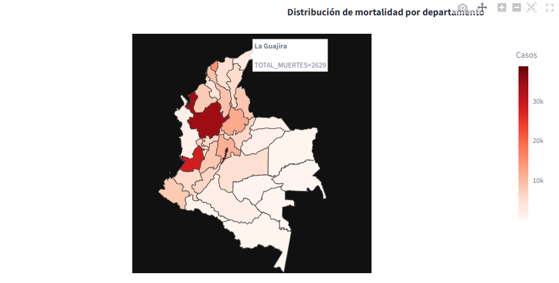
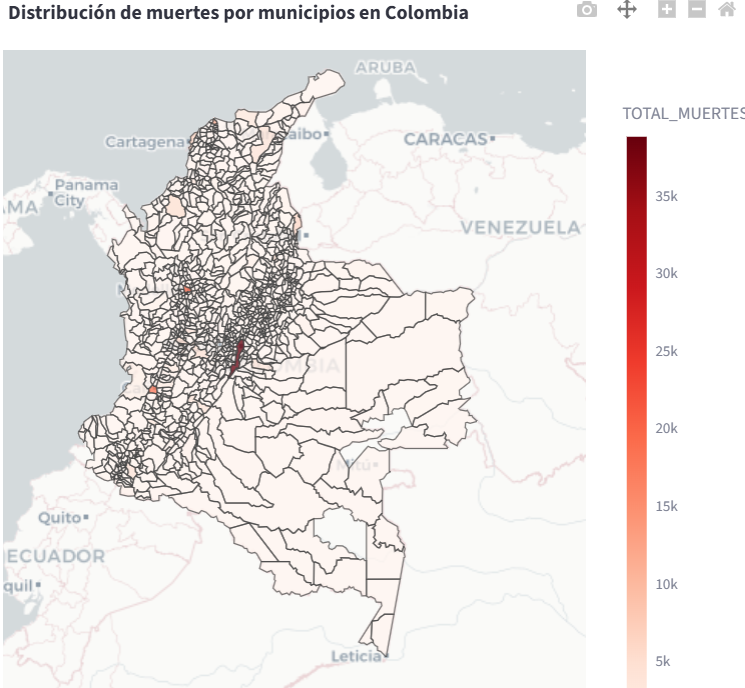
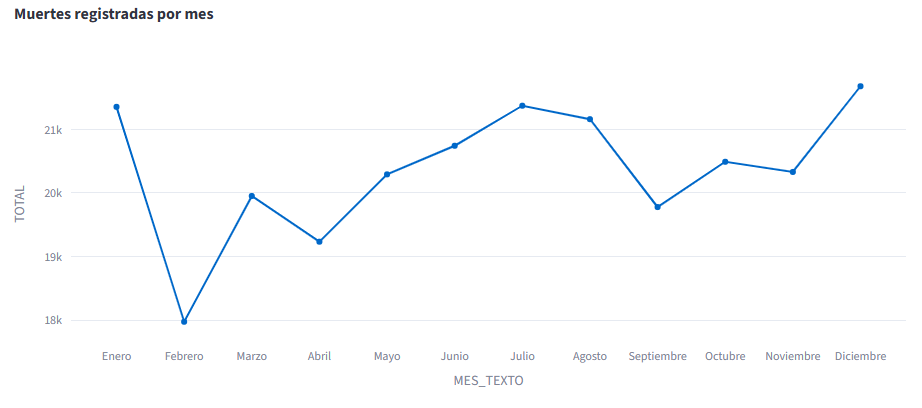
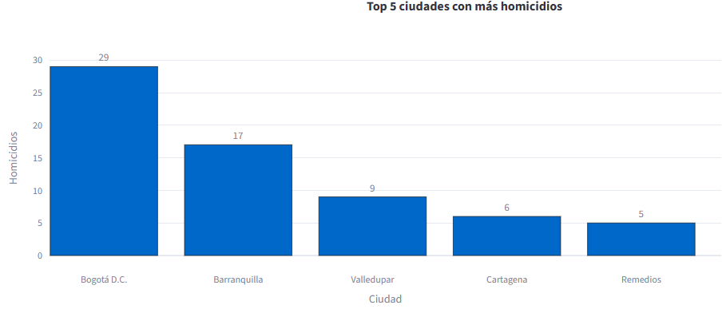
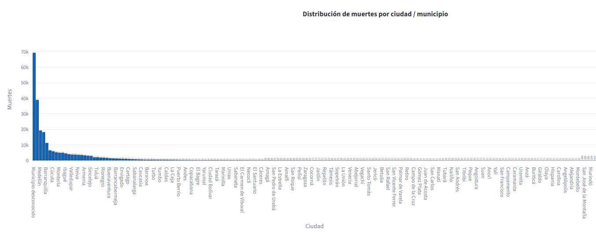
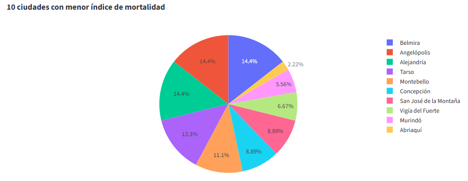
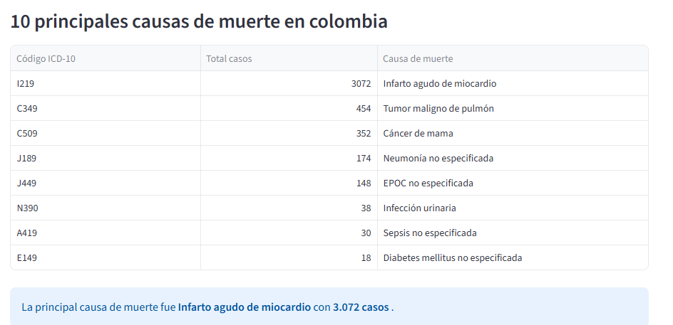
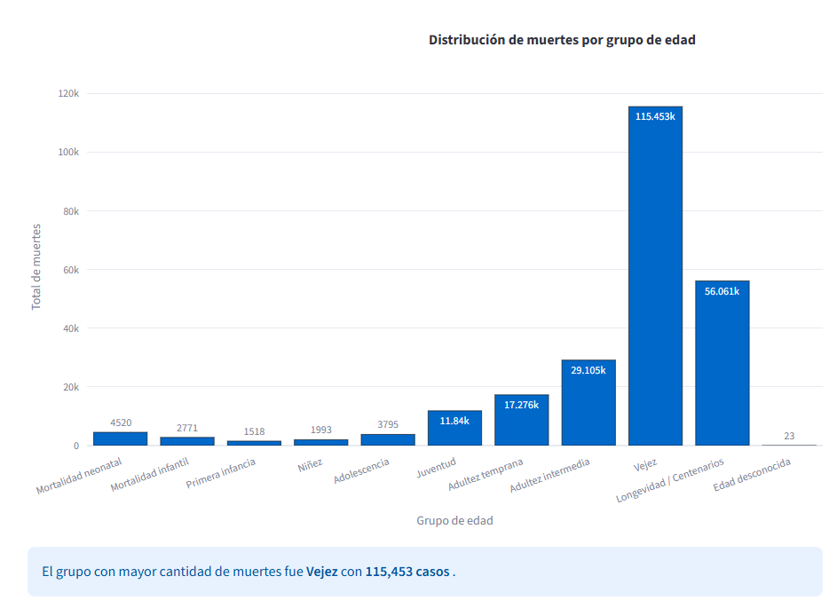
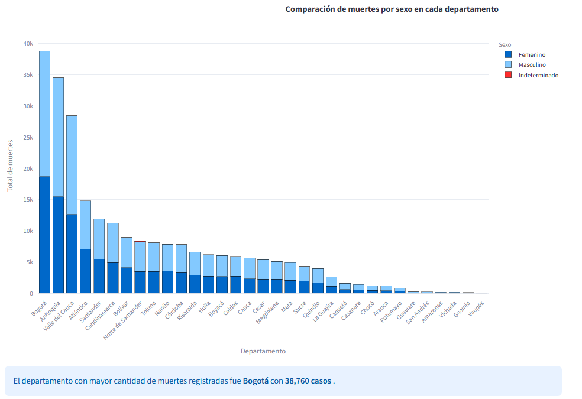

# Análisis de mortalidad en Colombia 2019
# 
# Introducción
# Esta aplicación web interactiva permite explorar y analizar los datos oficiales de mortalidad en Colombia para el año 2019 obtenidos del DANE. Esta herramienta permite reconocer los patrones de mortalidad por departamento, mes, causa, sexo y ciudad, mediante visualizaciones dinámicas como mapas, gráficos de líneas, entre otras herramientas. La aplicación permite su acceso público a estudiantes, investigadores y muchas otras personas.
# 
# Objetivo general
# Desarrollar una aplicación web interactiva en Streamlit que permita analizar e interpretar los datos de
# mortalidad en Colombia para el año 2019, utilizando visualizaciones gráficas y despliegue en Azure App
# Service.
# 
# Objetivos específicos
# • Cargar, limpiar y transformar datos reales de mortalidad en Colombia.
# • Integrar diferentes fuentes de datos mediante Python.
# • Construir visualizaciones interactivas con Streamlit y Plotly.
# • Interpretar los principales patrones de mortalidad por territorio, mes, causa, sexo y grupo de edad.
# • Desplegar la aplicación web en Azure App Service.
# • Documentar el proyecto en un repositorio de GitHub. 
# 
# Estructura del proyecto
# PASO 1:
# Cargar, limpiar y transformar los datos.
# PASO 2:
# Integrar diferentes fuentes de datos.
# PASO 3:
# Construir visualizaciones interactivas con Streamlit y Plotly.
# PASO 4:
# Interpretar los principales patrones de mortalidad por territorio, mes, causa, sexo y grupo de edad.
# PASO 5:
# Desplegar la aplicación web en Azure App Service.
# PASO 6:
# Documentar el proyecto en un repositorio de GitHub. 
# 
# Requisitos
# streamlit==1.28.0
# pandas==2.0.3
# plotly==5.17.0
# openpyxl==3.1.2
# 
# Despliegue en Azure
# Se utilizó Azure App Service con la configuración gratuita por cierto tiempo determinado y esta informacion es de dominio publico.
# 
# Software utilizado
# Python, Streamlit, Plotly, Pandas, VS Code, GitHub, Azure
# 
# Visualizaciones

#
# El mapa departamental de mortalidad permite una rápida identificación de las regiones con mayor concentración de fallecimientos. Es el caso del departamento de La Guajira, que destaca con un total de 2.629 muertes. La intensidad del fenómeno está codificada por colores en la visualización, lo que permite comparar la situación territorial y enfocar la atención en los territorios concretos que necesitan un análisis más detallado en materia de salud pública.
#

#
# El mapa coroplético refleja la distribución de los fallecimientos a nivel municipal, con una escala con intencidad de color que va del rojo (mayor mortalidad) al gris (menor mortalidad). Las ciudades con mayor población y las de capital de provincia son las que presentan los valores más elevados, mientras que las cifras más bajas corresponden a las zonas rurales o de menor densidad poblacional. Esta visualización es clave para focalizar las intervenciones a nivel local.
#

#
# En el gráfico de líneas se muestra la evolución de la mortalidad mes a mes durante el año 2019. En enero a agosto se mantiene una tendencia estable, con un ligero descenso en febrero y marzo, seguido de un aumento a partir de septiembre que alcanza su punto máximo en diciembre con unas 21.000 muertes. Este patrón apunta a posibles factores estacionales relacionados con enfermedades.
#

#
# En este gráfico de se muestran las cinco ciudades con mayor número de homicidios en el 2019. Bogotá D.C. es líder con 29 casos, le sigue Barranquilla con 17, Valledupar con 9, Cartagena con 6 y Remedios con 5. Aunque los números pueden parecer bajos, probablemente por filtros específicos en los datos, el gráfico permite identificar focos de violencia para de estamanera priorizar políticas de seguridad en estas partes.
#

#
# Según la grafica, la mortalidad muestra una marcada desigualdad territorial. En la primera posición está Medellín con 69.000 muertes, le siguen Barranquilla (39.000) y Cúcuta (12.000). Por otro lado, Caldas y La Ceja apenas sobrepasan los 100 fallecidos cada uno. La aparición de “Municipio desconocido” indica problemas de calidad en el registro de datos, lo que dificulta obtener mejores analisis.
#

#
# En el siguiente gráfico se expresa en forma circular la mortalidad en municipios como Belmira (14.4%), Concepción (14.4%), Montebello (13.3%) y Tarsco (11.1%). Estos municipios, que en su mayoría están en Antioquia, agrupan una importante parte de los fallecidos de su región.  En la visualización se puede ver que la mortalidad no solo afecta a las grandes ciudades sino también a los pequeños municipios que pueden tener limitaciones de acceso a servicios de salud y recursos.
#

#
# En la tabla se presentan las diez principales causas de muerte, encabezadas por el infarto agudo de miocardio con 3,072 casos, seguido por tumor maligno de pulmón con 454 casos y cáncer de mama con 352 casos. En Colombia, las principales amenazas para la salud son las enfermedades no transmisibles y no tanto las causas externas o infecciosas, ya que las enfermedades cardiovasculares, las respiratorias crónicas y las metabólicas ocupan los primeros lugares.
#

#
# El gráfico de barras nos muestra una clara relación entre edad y mortalidad donde el grupo de Vejez agrupa la mayor cantidad de fallecimientos con 115.453, seguido por Adultos intermedios (29.105) y Adultez temprana (17.276). Por el contrario, los grupos de Primera infancia (1,518) y Niñez (1,993) son los que presentan los números más bajos. El grupo de Edad desconocida también muestra un valor alto (115.453), lo que sugiere problemas en el registro de esta variable. Es un patrón que concuerda con el envejecimiento de la población y con que los adultos mayores son más vulnerables con respecto a los jovenes.
#

#
# Este gráfico de barras apiladas permite comparar la mortalidad por sexo de los principales departamentos. Bogotá es la que más muertes tuvo: un total de 38.019, de las cuales unas 19.000 fueron mujeres y 15.500 hombres. En cuestion de cifras sigue Antioquia (34.000 en total) y Valle del Cauca (29.000 en total). En la mayor parte de los departamentos, el sexo masculino tiene cifras un poco más altas que el femenino, excepto en Bogotá, donde la diferencia es menos notoria.
#
# En conclusión los principales resultados: Bogotá es el departamento con mayor número de fallecimientos (38.760 casos), diciembre el mes más complicado (21.678 fallecimientos), el sexo masculino el más afectado (134.573 casos), mientras que la edad de Vejez se concentra en 115.453 fallecimientos, siendo la causa más importante el Infarto Agudo de Miocardio (código I219) con 3.072 casos. Este breve resumen ofrece una visión general del fenómeno y confirma que la mortalidad en Colombia está determinada por factores territoriales, temporales, demográficos y clínicos.
#